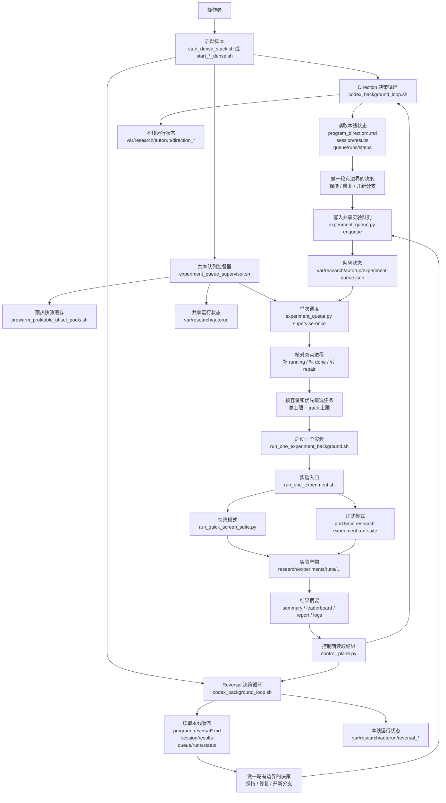

# Auto Research Framework Diagram

这份图按当前仓库里的 `auto_research/`、`src/pm15min/research/automation/` 和运行状态目录整理。

## 主流程图

## 责任分层

| 层级 | 主要文件 | 负责什么 |
| --- | --- | --- |
| 操作入口 | `auto_research/start_*.sh` | 启动、停止、查看不同研究线 |
| 决策循环 | `auto_research/codex_background_loop.sh` | 让 Codex 读状态并决定下一步 |
| 研究规则 | `auto_research/program*.md` | 约束每条线能研究什么、不能碰什么 |
| 队列入口 | `auto_research/experiment_queue.py` | 记录、展示、调度队列里的任务 |
| 队列监督器 | `auto_research/experiment_queue_supervisor.sh` | 持续填满可用实验槽位 |
| 单实验启动 | `auto_research/run_one_experiment*.sh` | 启动一个快筛或正式实验 |
| 可复用逻辑 | `src/pm15min/research/automation/` | 组装提示、读状态、排队、修复、排序、摘要 |
| 实验执行 | `scripts/research/run_quick_screen_suite.py` 和 `pm15min research experiment run-suite` | 真正训练、回测、产出结果 |
| 长期记录 | `sessions/...` | 每轮决策和实验结论 |
| 运行状态 | `var/research/autorun/...` | pid、日志、上次提示、队列、状态文件 |
| 实验产物 | `research/experiments/runs/...` | 每次实验的结果、榜单、报告、日志 |

## 当前仓库里能看到的状态

- 代码结构已经是“决策”和“执行”分离：Codex 循环只决定下一步，队列监督器负责把决定变成真实实验。
- dense 结构默认分两条线：`direction` 和 `reversal`，共享一个实验队列和实验容量。
- 当前默认 dense 容量目标是总共 5 个 SOL/XRP 快筛实验，其中 direction 3 个、reversal 2 个。
- BTC/ETH 正式实验不走这条 SOL/XRP 快筛共享队列；它们由各自的 midprice direction 线路单独运行。
- 内存紧张时优先保盘口录制和 BTC/ETH 正式实验，先暂停 SOL/XRP 快筛调度和快筛大进程。
- 当前本地 `var/research/autorun/` 里能看到旧的单线 Codex 状态文件，但没有看到共享队列文件 `experiment-queue.json`；也没有看到本地 `sessions/` 目录内容。这说明当前这份本地副本保留了控制代码和部分运行痕迹，但完整会话记录可能不在这台机器或未同步到当前目录。
